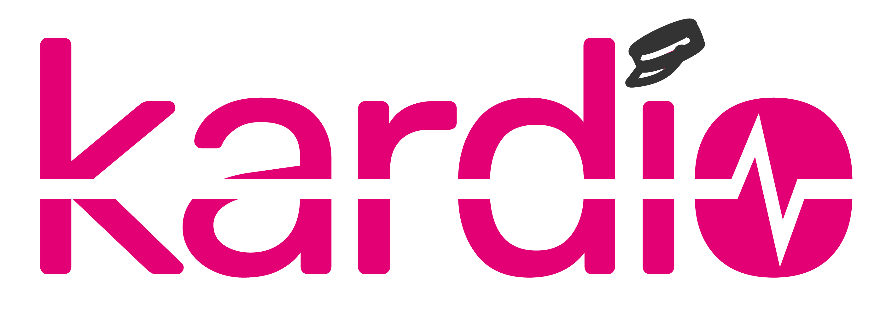

# Introduction
**Kardio** is a simple tool that can be configured to perform health checks on any endpoint. Kardio has a rich UI showing status and availability based on responses from REST endpoints, TCP ports, etc. It is also integrated with Slack and email for alerting.

At T-Mobile, USA, Inc. we run several massive multi-tenant Container Orchestration platforms and these platforms rely on monitoring tools such as Prometheus, Grafana, etc. A status check system that is standalone and is independent of the primary monitoring stack was required in the event of degraded performance in any part of the primary monitoring system. We started Kardio as a simple status UI for services on our platforms, and later added more features as our platforms grew and adopted Kubernetes.

## QuickStart

For a quick test-drive of Kardio, follow the steps in [Quick Start](./docs/setup.md#running-from-pre-built-docker-images) 

## Functionality

### Health Checks

Kardio has the capability to perform health checks of web services:

-   Auto-Discover and perform health checks for Services deployed on Kubernetes and Marathon
-   Perform Health Check for manually configured Services

### High Availability

Kardio supports a High Availability (HA) mode with a two-node cluster in active-passive configuration. The HA mode is designed to work across multiple regions if required. 

### Multi-Region/Multi Environment Support
Kardio has the capability to run on multiple Regions. The Kardio dashboard displays data for every available Environment/Region.

### RBAC
Kardio supports Role Based Access Control/Restrictions using LDAP integration. See [RBAC Integration](./docs/Integrations.md#ldap-integration) for more information

## Feature Highlights

-   Health status of services is provided with up-to-date information per minute.
-   Supports two regions for a service.
-   Supports multiple environments.
-   Multiple status checks are performed for a single service.
-   Custom health checks can be written (in Java) for any service.
-   Announcements can be published on home page.
-   Displays real-time data from custom sources at the top of the dashboard, such as Total Transactions, TPS, Total Containers Run, Running Containers, Uptime, etc.
-   Users can subscribe to status change alerts via email and Slack.
-   Availability percentage of each service per year, month and date are displayed in the dashboard.
-   Users can easily search a list for a specific application, service or component.
-   Services with health status changes in the last 24 hours are highlighted in Recent Events, with change details displayed as messages for the corresponding service.
-   Logged in users can add/edit messages for the applications and services to which they have access. For example, users can add messages such as “The application is down for maintenance” for a specific service.
-   The Admin page enables users to manage the Kardio configuration.
-   Role Based Access is enabled for the Marathon application and admin page via LDAP integration.
-   The History page displays the service health history for the last seven days.
-   Kardio supports the Prometheus push gateway for monitoring services.
-   Health status is displayed using the following symbols:

## UI Features

Kardio UI has the following components. 

-   **Counters -** Display Total Transactions (http requests), Current Requests per Second, Total Containers Run, Current Running Containers, Number of services running and Uptime in percentage on all clusters individually and combined.
-   **Dashboard -** All services deployed in a cluster will be visible by environments and region.
-   **History -** Last 7 days of status of each service by environments will be displayed with reason for failures and timestamp.
-   **API Dashboard -** Trend of Services, Containers, RPS and Latency over period of time will be displayed in a graph. Filters based on Platform, Environment, Application will be displayed with an option to export the graph in PDF file.
-   **Admin Console -**  Authentication is based on LDAP and admins will have ability to add/modify/delete Counters, Environments and Messages. Admins can add any endpoints to monitor and also to alert users, include release notifications on top of each environments as well.

## Installation
For Installation instructions and to build from source please follow the [Setup Guide](./docs/setup.md)

## Announcement Blog Post
[Introducing Kardio](https://opensource.t-mobile.com/blog/posts/introducing-kardio/)

## License
Kardio is open-sourced under the terms of the Apache 2.0 license and is released AS-IS WITHOUT WARRANTIES OR CONDITIONS OF ANY KIND pursuant to Section 7 of the Apache 2.0 license.
